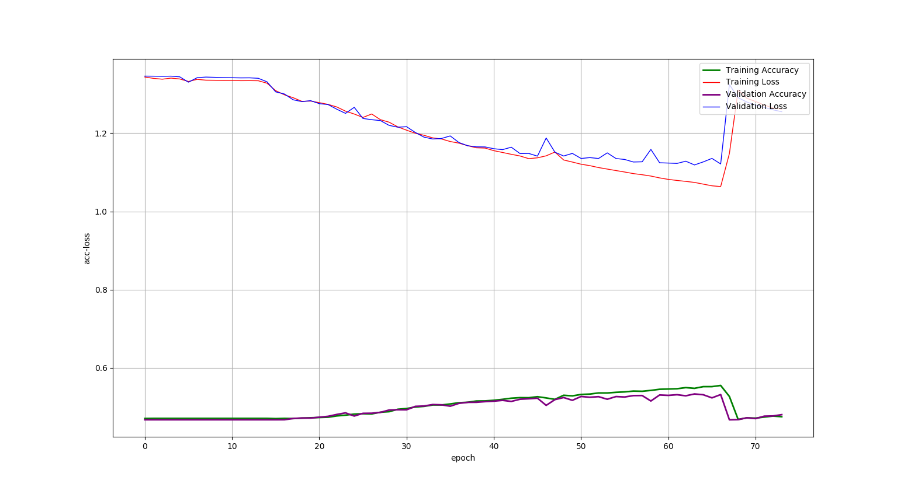

# SentimentAnalysisOnMovieReviews
Kaggle竞赛题目[Sentiment Analysis on Movie Reviews](https://www.kaggle.com/c/sentiment-analysis-on-movie-reviews)多种算法实现

## 1. 不同实现方法的得分
以下各种实现方法的得分是针对相应代码中的参数和网络结构设计的情况下的得分, **此处不表示各种算法本身的性能对比**

| 实现方法 | Score | 迭代次数(采用early stopping)近似值 | 说明 |
| :--- | :---: | :---: | :--- |
| **LSTM v1.0** | 0.58319 | 50(从下面的loss-acc曲线可以看出并没有收敛, underfitting) | 采用word2vec([GoogleNews-vectors-negative300.bin](https://github.com/3Top/word2vec-api)), 没有考虑PhraseId和SentenceId, 训练集中重复样本没有去重 |
| **LSTM v2.0** |  | 300 | 同v1.0，仅增加迭代次数 |

## 2. 关于预处理
拿到数据首先应该做的就是预处理, 包括一些数据统计工作, 例如**统计样本的数据分布情况(label是否分布均匀)**, **查看样本数据缺失值的情况(并填补缺失值)**, **标准化&归一化**, **to_categorical**, **reshape**, **train_test_split**, **数据扩充(data augmentation)**, **特征提取**, **特征选择**, **降维**等

## 3. LSTM实现方法结果绘制
1. 迭代次数(epochs)取50时的loss和accuracy曲线如下图所示:
   
 从图中我们可以看出训练集和验证集上的accuracy都还在提高, loss都还在下降, 说明模型参数还可以继续迭代优化, 以提升模型预测效果

## 4. 分析
1).当`batch_size`取值为64, `epochs`到74时由于代码中的`EarlyStopping(monitor="val_loss", patience=10)`的设置，训练停止.  
```bash
71040/71040 [==============================] - 369s 5ms/step - loss: 1.3435 - acc: 0.4705 - val_loss: 1.3459 - val_acc: 0.4672
Epoch 2/100
71040/71040 [==============================] - 368s 5ms/step - loss: 1.3401 - acc: 0.4708 - val_loss: 1.3457 - val_acc: 0.4672
Epoch 3/100
71040/71040 [==============================] - 368s 5ms/step - loss: 1.3380 - acc: 0.4708 - val_loss: 1.3454 - val_acc: 0.4672
Epoch 4/100
71040/71040 [==============================] - 368s 5ms/step - loss: 1.3408 - acc: 0.4708 - val_loss: 1.3458 - val_acc: 0.4672
Epoch 5/100
71040/71040 [==============================] - 369s 5ms/step - loss: 1.3386 - acc: 0.4708 - val_loss: 1.3440 - val_acc: 0.4672
Epoch 6/100
71040/71040 [==============================] - 368s 5ms/step - loss: 1.3322 - acc: 0.4708 - val_loss: 1.3303 - val_acc: 0.4672
Epoch 7/100
71040/71040 [==============================] - 368s 5ms/step - loss: 1.3376 - acc: 0.4708 - val_loss: 1.3419 - val_acc: 0.4672
Epoch 8/100
71040/71040 [==============================] - 368s 5ms/step - loss: 1.3355 - acc: 0.4708 - val_loss: 1.3434 - val_acc: 0.4672
Epoch 9/100
71040/71040 [==============================] - 369s 5ms/step - loss: 1.3352 - acc: 0.4708 - val_loss: 1.3427 - val_acc: 0.4672
Epoch 10/100
71040/71040 [==============================] - 368s 5ms/step - loss: 1.3347 - acc: 0.4708 - val_loss: 1.3420 - val_acc: 0.4672
...

Epoch 65/100
71040/71040 [==============================] - 369s 5ms/step - loss: 1.0697 - acc: 0.5519 - val_loss: 1.1265 - val_acc: 0.5312
Epoch 66/100
71040/71040 [==============================] - 369s 5ms/step - loss: 1.0654 - acc: 0.5520 - val_loss: 1.1354 - val_acc: 0.5232
Epoch 67/100
71040/71040 [==============================] - 369s 5ms/step - loss: 1.0635 - acc: 0.5550 - val_loss: 1.1213 - val_acc: 0.5317
Epoch 68/100
71040/71040 [==============================] - 368s 5ms/step - loss: 1.1481 - acc: 0.5268 - val_loss: 1.3241 - val_acc: 0.4671
Epoch 69/100
71040/71040 [==============================] - 369s 5ms/step - loss: 1.3103 - acc: 0.4682 - val_loss: 1.2908 - val_acc: 0.4675

Epoch 00069: ReduceLROnPlateau reducing learning rate to 0.0006400000303983689.
Epoch 70/100
71040/71040 [==============================] - 369s 5ms/step - loss: 1.2890 - acc: 0.4721 - val_loss: 1.2796 - val_acc: 0.4723
Epoch 71/100
71040/71040 [==============================] - 368s 5ms/step - loss: 1.2810 - acc: 0.4715 - val_loss: 1.2718 - val_acc: 0.4702
Epoch 72/100
71040/71040 [==============================] - 369s 5ms/step - loss: 1.2718 - acc: 0.4742 - val_loss: 1.2661 - val_acc: 0.4765
Epoch 73/100
71040/71040 [==============================] - 368s 5ms/step - loss: 1.2643 - acc: 0.4767 - val_loss: 1.2596 - val_acc: 0.4770
Epoch 74/100
71040/71040 [==============================] - 368s 5ms/step - loss: 1.2616 - acc: 0.4751 - val_loss: 1.2549 - val_acc: 0.4803
```
  
**从上面的输出结果和acc-loss曲线图可以看出，从第68次迭代开始, 以后的训练集和验证集上的loss都在上升**, 为什么会这样？
经[网上](https://www.zhihu.com/question/60565283/answer/177990842)查阅:
> loss下降后又上升可能性太多了：  
> 1.模型可以学习到，只是剃度震荡导致降不到最优，这种可以考虑降低学习率，增大batch的大小。  
> 2.数据可以学习到，但是模型拟合能力不够强。可以考虑增大cnn深度，比如换成vgg16测试下，另外lstm也可以换成双向的加强拟合能力  
> 3.训练集能百分百但是测试集只能89%，这种最有效的方法是增大训练数据，当然也可以试试一些正则方法比如bn，dropout等  

感觉这里的情况与上面的第一条应该是相关的，所以尝试降低学习率，增大batch_size


## TODO
1. batch_size取1024**似乎**不如512模型收敛的速度快(要达到相同的精度, batch_size为1024时需要的epochs更多)
2. 尝试将初始lr调整为1e-4，现在的默认值好像是1e-3，lr的decay应该取得大一点（decay的速度要加快一点点?）
3. 初始的曲线很平, 感觉学习率有点儿小, 可以调大学习率?

